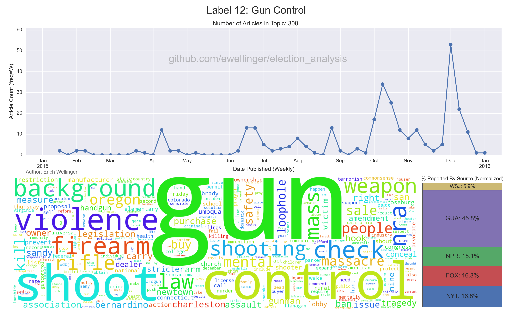
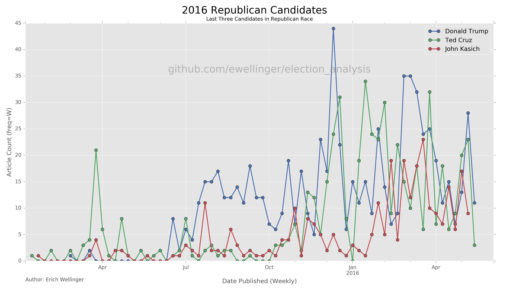
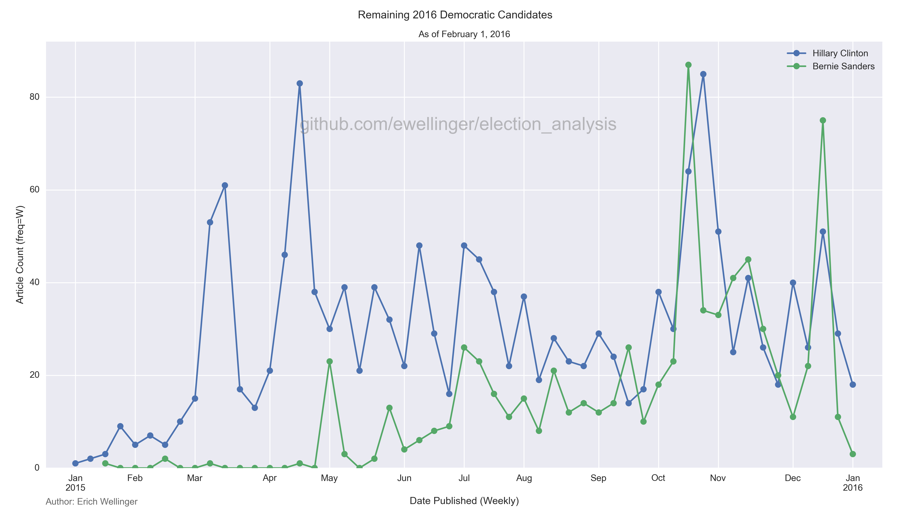

<center><h1>Election Analysis</h1>

<h4>Data Science Capstone Project</h4></center>

---
The purpose of this project is to scrape a variety of news sites for articles covering the 2016 U.S. Election cycle throughout 2015 as part of the Galvanize Data Science Immersive Capstone Project.  Natural Language Processing analysis will then be done on the text of the articles to see what latent topics are present in the media coverage across a variety of news outlets.  Analysis was primarily done using Non-Negative Matrix Factorization (NMF) for extracting latent topics from the corpus.

Time permitting, similar analysis will be done on previous general election cycles (e.g. 2007 for the election cycle of Obama's first election).  Future plans for this project include deploying a front facing website for exploring the resulting topics and how the coverage of media outlets differ within topics, as well as how their coverage varies over the course of the year.

Below is an example of one of the latent topics extracted with the [NMF][wiki-nmf] Algorithm.  This graph shows the number of articles attributed to this topic over the course of 2015, a breakdown of the normalized percentage of coverage by each news outlet, and a word cloud showing the most prominent words associated with this topic.  Following the explanation of the methodology behind the data collection, processing, and analysis, other topics will be explored.

[wiki-nmf]: https://en.wikipedia.org/wiki/Non-negative_matrix_factorization




---

### Web-Scraping Methodology

Web Scraping scripts for each of the included news outlets were written employing the python packages `BeautifulSoup` and `selenium`.  Several of the web-scraping scripts also employ multi-threading techniques for performance boosts.  Currently the dataframe has articles from the following news outlets:
* Fox News
* The New York Times (API)
* The Wall Street Journal
* The Guardian (API)
* NPR (API)

Searches were then performed for each of the following keywords (see below) for each day in a particular time period across each news outlet.  A article was then assumed to being pertained to the general election if the body of the article contained one or more of the candidate(s) full names (e.g. A search for `sanders` may yield an article about Deion Sanders rather than Bernie Sanders, which should not be included).

```python
keywords = ['jeb bush', 'carson', 'christie', 'cruz', 'fiorina', 'jim gilmore',
            'lindsey graham', 'huckabee', 'kasich', 'george pataki',
            'rand paul', 'rubio', 'santorum', 'donald trump', 'rick perry',
            'scott walker', 'jindal', 'clinton', "o'malley", 'omalley',
            'sanders', 'jim webb', 'chafee', 'lessig', 'biden']
```

Articles pertaining to the general election will then be added to a Mongo Database with metadata and article text for further analysis.  In the case of the Fox News and Wall Street Journal scrapers, relevant url addresses were first saved to a text file prior to extracting metadata and article text.

Other Possible News Outlets To Include:
* USA Today (Waiting for API Access)
* The Washington Post
* MSNBC
* NBC News
* ~~CNN~~ (No way to scrape)
* ~~BBC~~ (No good way to scrape, API is only open to BBC Employees)
* ~~Al Jazeera~~ (No way to scrape)

---

### 2016 Candidates
#### Republican

Candidate      | Announcement Date | Suspension Date
---------------|:-----------------:|:--------------:
Ted Cruz       |    03/23/2015     |       N/A
Rand Paul      |    04/07/2015     |   02/03/2016
Marco Rubio    |    04/13/2015     |       N/A
Ben Carson     |    05/04/2015     |       N/A
Carly Fiorina  |    05/04/2015     |       N/A
Mike Huckabee  |    05/05/2015     |   02/01/2016
Rick Santorum  |    05/27/2015     |   02/03/2016
George Pataki  |    05/28/2015     |   12/29/2015
Lindsey Graham |    06/01/2015     |   12/21/2015
Rick Perry     |    06/04/2015     |   09/11/2015
Jeb Bush       |    06/15/2015     |       N/A
Donald Trump   |    06/16/2015     |       N/A
Bobby Jindal   |    06/24/2015     |   11/17/2015
Chris Christie |    06/30/2015     |       N/A
Scott Walker   |    07/13/2015     |   09/21/2015
John Kasich    |    07/21/2015     |       N/A
Jim Gilmore    |    07/30/2015     |       N/A


#### Democratic

Candidate       | Announcement Date | Suspension Date
----------------|:-----------------:|:--------------:
Hillary Clinton |    04/12/2015     |       N/A
Bernie Sanders  |    04/30/2015     |       N/A
Martin O'Malley |    05/30/2015     |   02/01/2016
Lincoln Chafee  |    06/03/2015     |   10/23/2015
Jim Webb        |    07/02/2015     |   10/20/2015
Lawrence Lessig |    09/06/2015     |   11/02/2015
Joe Biden       |        N/A        |   10/21/2015

Below we can see how the media coverage of select candidates compares over the course of 2015.  For brevity only a select few candidates were included on each plot.







---

### Data Cleaning

Several data cleaning steps were taken in the `clean_data.py` script to read in the data from the Mongo Database and produce the final `pandas` dataframe which the analysis was conducted on.  The resulting dataframe was pickled for easy access in subsequent scripts.

Cleaning Steps Included:
* Convert `date_published` to the proper datetime format
* Remove numbers, email addresses, and punctuation from the article text
* Parse unicode characters from article text
* Filter out any articles whose article text doesn't contain at least one candidate name
* Text Processing / Lemmatization (See Below)
* Add sentiment data to dataframe using `pattern.en` [sentiment][pattern-sentiment] function

[pattern-sentiment]: http://www.clips.ua.ac.be/pages/pattern-en#sentiment

---

### Text Processing
