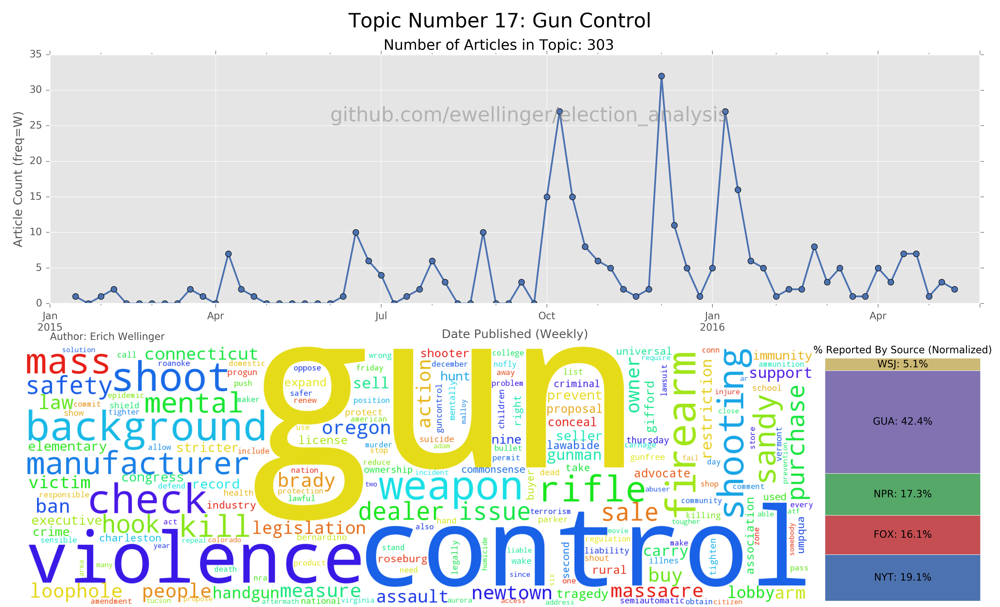
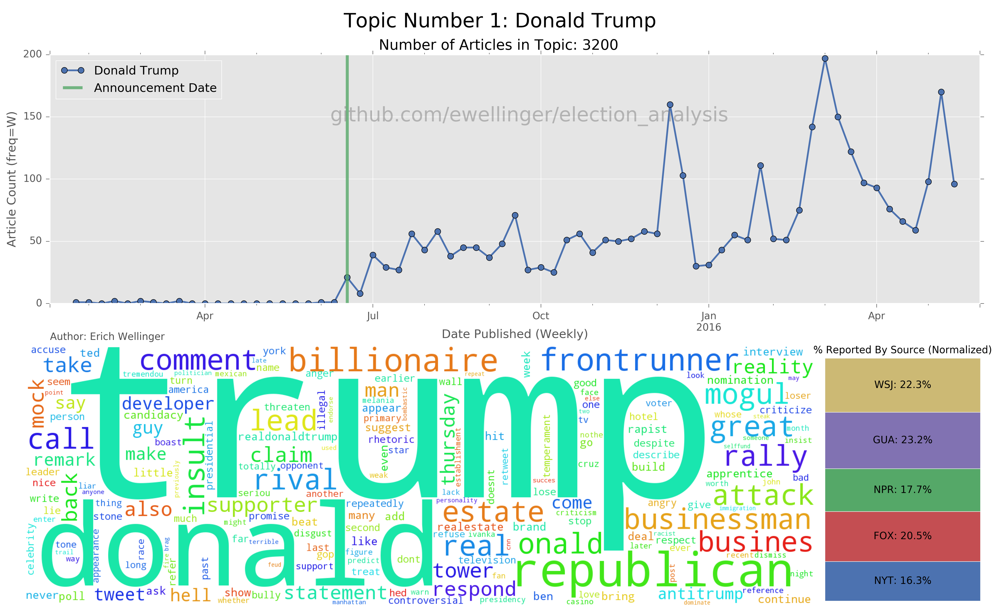
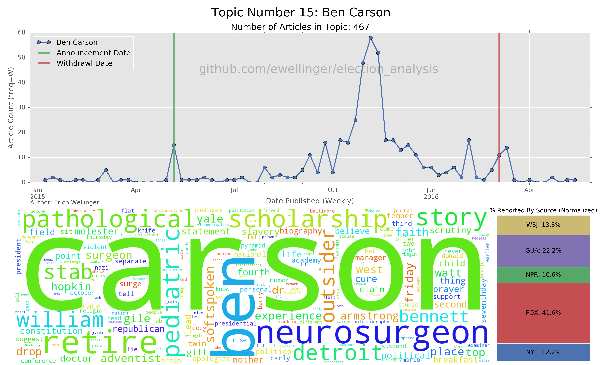
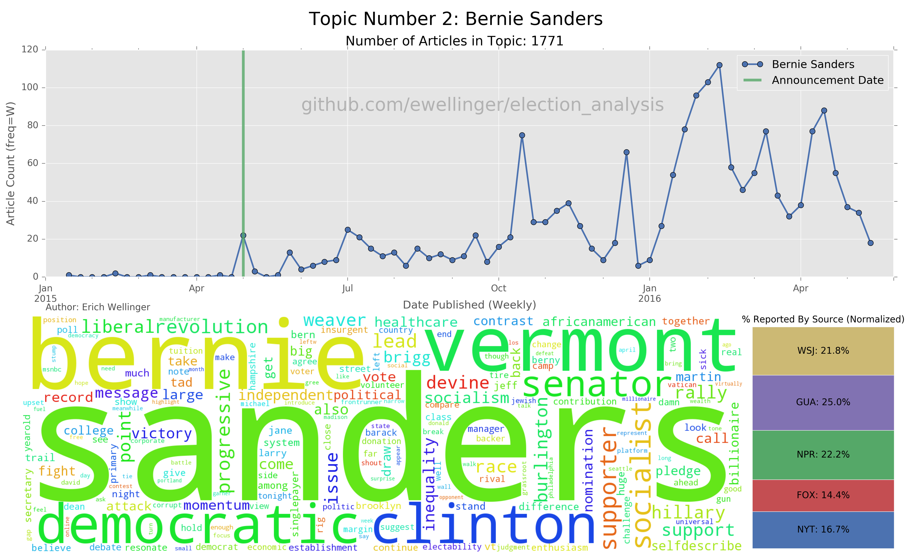
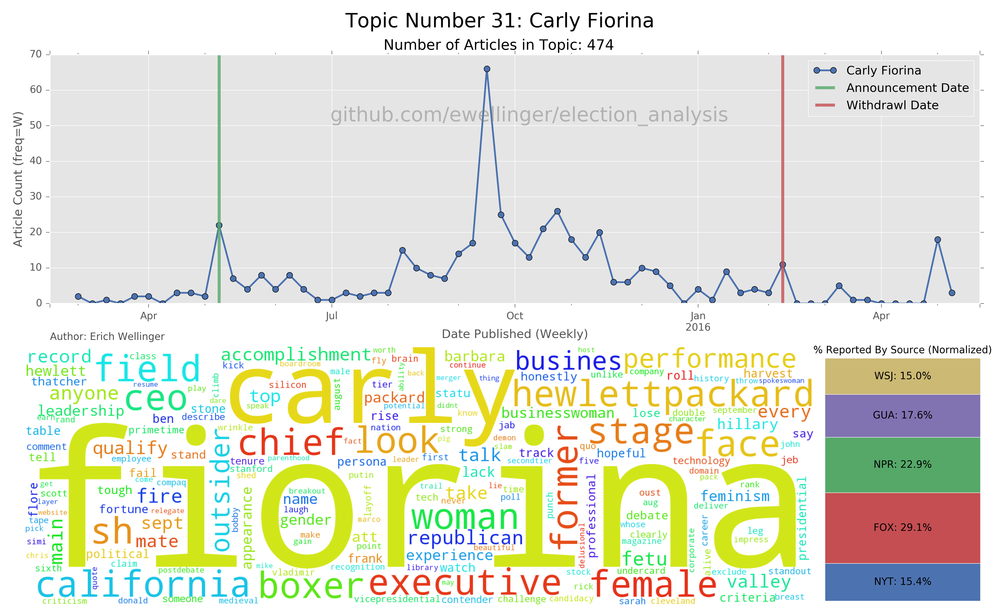
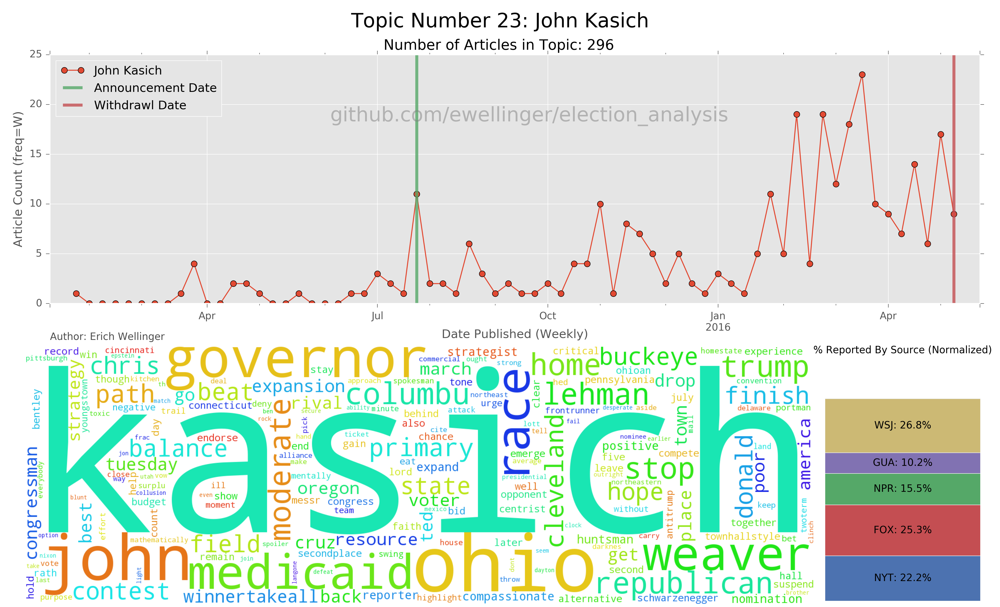

<center><h1>Election Analysis</h1>

<h4>Data Science Capstone Project</h4></center>


## Note: I am currently updating the code and adding more detail to the README
### Should be up by 7/16/2016 so check back soon!
---
The purpose of this project is to scrape a variety of news sites for articles relating to the 2016 U.S. Election cycle as part of my Galvanize Data Science Immersive Capstone Project.  Natural Language Processing analysis will then be done on the text of the articles to see what latent topics are present in the media coverage across a variety of news outlets.  Once latent topics are identified, we can look at how certain topics are trending over time and whether certain outlets are reporting on them more prevalently than others.  While predicting a winner would be nice, the ultimate goal of this project is to identify how the media is reporting on the election and not to predict the outcome.

Analysis was primarily done using Non-Negative Matrix Factorization (NMF) for extracting latent topics from the corpus.  Currently data is present from The New York Times, Fox News, The Guardian, NPR, and The Wall Street Journal ranging from January 1st, 2015, to May 15th, 2016, with 21,160 articles in total.

Future steps could include performing a similar analysis on previous general election cycles (e.g. 2007 for the election cycle of Obama's first election) to identify topics which are perennially present in the coverage of a Presidential election regardless of the candidates or current events.  Twitter data could also be incorporated to compare how social media influences what stories the media reports on (i.e. does the reporting by news outlets drive the discourse on social media or vice-versa?)

Below is an example of one of the latent topics extracted with the [NMF][wiki-nmf] Algorithm.  This graph shows the number of articles attributed to this topic over the course of election cycle (up to May 15th), a breakdown of the normalized percentage of coverage by each news outlet, and a word cloud showing the most prominent words associated with this topic.  Following the explanation of the methodology behind the data collection, processing, and analysis, other topics will be explored.

[wiki-nmf]: https://en.wikipedia.org/wiki/Non-negative_matrix_factorization



---

## Web-Scraping Methodology

Web Scraping scripts for each of the included news outlets were written employing the python packages `BeautifulSoup` and `selenium`.  Several of the web-scraping scripts also employ multi-threading techniques for performance boosts.  Currently the Dataframe has articles from the following news outlets:

* Fox News (5,739 Articles)
* The New York Times (API) (8,944 Articles)
* The Wall Street Journal (2,419 Articles)
* The Guardian (API) (2,863 Articles)
* NPR (API) (1,195 Articles)

Searches were then performed for each of the following keywords for each day in a particular time period across each news outlet:

```python
keywords = ['jeb bush', 'carson', 'christie', 'cruz', 'fiorina', 'jim gilmore',
            'lindsey graham', 'huckabee', 'kasich', 'george pataki',
            'rand paul', 'rubio', 'santorum', 'donald trump', 'rick perry',
            'scott walker', 'jindal', 'clinton', "o'malley", 'omalley',
            'sanders', 'jim webb', 'chafee', 'lessig', 'biden']
```

All articles that were returned were assumed to be at least cursorily related to the general election (further checks are done to ensure this during the [data cleaning](#data-cleaning) phase) and were then added to a Mongo Database with metadata and article text for further analysis.  In the case of the Fox News and Wall Street Journal scrapers, relevant url addresses were first saved to a text file prior to extracting metadata and article text.

All scripts associated with collecting the data are located in the [scrapers](./scrapers) folder.

Now let's take a look at the plethora of candidates we had to choose from when the race was first getting started!

---

## 2016 Candidates
### Republican

Candidate      | Announcement Date | Suspension Date
---------------|:-----------------:|:--------------:
Ted Cruz       |    03/23/2015     |   05/03/2016
Rand Paul      |    04/07/2015     |   02/03/2016
Marco Rubio    |    04/13/2015     |   03/15/2016
Ben Carson     |    05/04/2015     |   03/02/2016
Carly Fiorina  |    05/04/2015     |   02/10/2016
Mike Huckabee  |    05/05/2015     |   02/01/2016
Rick Santorum  |    05/27/2015     |   02/03/2016
George Pataki  |    05/28/2015     |   12/29/2015
Lindsey Graham |    06/01/2015     |   12/21/2015
Rick Perry     |    06/04/2015     |   09/11/2015
Jeb Bush       |    06/15/2015     |   02/20/2016
Donald Trump   |    06/16/2015     |       N/A
Bobby Jindal   |    06/24/2015     |   11/17/2015
Chris Christie |    06/30/2015     |   02/10/2016
Scott Walker   |    07/13/2015     |   09/21/2015
John Kasich    |    07/21/2015     |   05/04/2016
Jim Gilmore    |    07/30/2015     |   02/12/2016


### Democratic

Candidate       | Announcement Date | Suspension Date
----------------|:-----------------:|:--------------:
Hillary Clinton |    04/12/2015     |       N/A
Bernie Sanders  |    04/30/2015     |       N/A
Martin O'Malley |    05/30/2015     |   02/01/2016
Lincoln Chafee  |    06/03/2015     |   10/23/2015
Jim Webb        |    07/02/2015     |   10/20/2015
Lawrence Lessig |    09/06/2015     |   11/02/2015
Joe Biden       |        N/A        |   10/21/2015

Below we can see how the media coverage of topics associated with particular candidates compare over the course of the election season.  For brevity, only a select few candidates will be shown for each plot.


**NOTE**: It may appear that Hillary Clinton has a relatively few number of articles associated with her topic, but that actually isn't the case.  Due to the media storm around certain aspects of Clinton's candidacy, the NMF algorithm factored the general "Hillary Clinton" topic into multiple topics associated with different aspects of her bid for the Presidency.  For example, topics exist related to her use of a private email server (Topics 3, 4, 198), the Clinton Foundation (Topic 51), and the investigation surrounding the Benghazi attack (Topics 30, 98, 222).  We will see later what it means for a more general subject, such as the Benghazi attack, to be factored into multiple topics.


We can then take a look at each candidate's topic in turn and overlay the dates in which they announced and, if applicable, withdrew their candidacy.  A word cloud indicating the most prominent words for that topic and a breakdown of how prevalently particular news sources were reporting on it are also provided (this bar chart is normalized by how many articles that that outlet has in the corpus to account for the sheer volume of articles published).  For a breakdown of each candidate, please refer to the [candidate_plots](./candidate_plots) folder.











---

## Data Cleaning

Several data cleaning steps were taken in the [`clean_data.py`](./clean_data.py) script to read in the data from the Mongo Database and produce the final `pandas` dataframe which the analysis was conducted on.  The resulting dataframe was pickled for easy access in subsequent scripts.

Cleaning Steps Included:
* Convert `date_published` to the proper datetime format
* Remove numbers, email addresses, and punctuation from the article text
* Parse unicode characters from article text
* Filter out any articles whose article text doesn't contain at least one candidate name
* Text Processing / Lemmatization (See Below)

One vitally important step was to double check that an article contained in our Mongo Database did, in fact, pertain in some way to the general election.  This was done by ensuring the body of an article contained one or more of the candidate(s) full names (e.g. A search for `sanders` may yield an article about Deion Sanders rather than Bernie Sanders, which should not be included).

It's also important to note that these articles might not necessarily be solely about the upcoming election.  For example, an article may be written about the water crisis in Flint Michigan and a candidate weighs in with their opinion.  While this isn't directly related to the election, it does factor into the political discourse and should therefore be included.  Indeed, topic number 83 is concerning the [Flint Water Crisis](./plots/topic_plots/flint_water_crisis.png).

---

## Text Processing

While cleaning your data is an important step in any data science project, there are specific steps that are required when working with text data in order to perform analysis on your results.  Among these text oriented steps include removing stop words, stemming/lemmatizing your text, looking at n-grams, part-of-speech tagging, and creating some sort of numeric representation of the words (e.g. Term Frequency or a TfIdf matrix).

Not all of these steps are necessarily required (in fact several of these options are not implemented in my project) but a quick run down of each is in order.

### Stop Words
The first step is to remove [stop words](https://en.wikipedia.org/wiki/Stop_words) from our corpus.  Stop words are words that frequently occur in text which make the language grammatically correct but don't actually lend any meaning to what a particular sentence is conveying.  Because of how common they are in the language and how little meaning they convey, we generally want to drop them entirely from our text corpus.  The following are a handful of examples of stop words that could be removed...

```python
['i', 'me', 'my', 'myself', 'we', 'our', 'ours', 'ourselves', 'you', 'your', 'yours', ...]
```

This is far from a complete list nor is there a canonical list of what words should be dropped.  Furthermore, there are different sets of stop words for a given language.  For example, the list of english stop words given by the `NLTK` package in python contains 127 words to drop.

Apart from these common words, we should extend our list of stop words based off domain-knowledge associated with whatever text we are analyzing.  For example, I extended these common stop words with words or phrases that are commonly associated with politics/political campaigns by dropping words like `'new york times'`, `'gov'`, `'sen'`, `'rep'`, `'campaign'`, `'candidate'`, & c.  


### Lemmatization
The next step is to implement some form of [text stemming](https://en.wikipedia.org/wiki/Stemming) or [lemmatization](https://en.wikipedia.org/wiki/Lemmatisation).  At a high level this serves to remove any inflectional endings and morph a word to its base or dictionary form of a word (known as the word's lemma).  Because we are concerned with how frequently a given word occurs, variations on a particular word should be counted as the same entity.  i.e. the words `ran`, `run`, `runs`, and `running` should all be altered to `run`.

There are a variety of packages to accomplish this task including many packaged into the `NLTK` package (e.g. [Porter Stemmer](http://www.nltk.org/_modules/nltk/stem/porter.html), [Snowball Stemmer](http://www.nltk.org/_modules/nltk/stem/snowball.html), [WordNet Lemmatizer](http://www.nltk.org/_modules/nltk/stem/wordnet.html)).  For the purposes of this project, I employed the [lemmatizer](http://www.clips.ua.ac.be/pages/pattern-en#conjugation) packaged into the `pattern` package, which I found to work significantly better than those offered by `NLTK`.  


### Looking at n-grams
When looking text data, we sometimes want to preserve some aspect of the order in which the words originally occurred rather than treating them solely as a bag-of-words.  [N-grams](https://en.wikipedia.org/wiki/N-gram) allow us to incorporate order into how our analysis is done.

For example, we intuitively know that the phrases 'New Jersey' or 'New York Yankees' refer to a specific thing and so it makes sense that these words be kept together.  When using bigrams we would end up with the resulting tokens... `'New Jersey => ('New', 'Jersey')'` and `'New York Yankees' => ('New', 'York'), ('York', 'Yankees')`.

Whether to use n-grams and what n to choose is one consideration to keep in mind when performing natural language processing.

**NOTE**: This project didn't incorporate n-grams in the analysis.


### Part-Of-Speech Tagging
One other technique to consider when performing Natural Language Processing is altering how you treat a word based off of its part-of-speech (e.g. if the word is a Noun, Verb, Adjective, Adverb, & c.).  For instance, maybe you only run the lemmatization step on words which aren't nouns or you drop any words that aren't a certain part of speech.  It's easy to see that your analysis can get increasingly complex as you incorporate these bits of information.  To see just how powerful this can be, consider [this tutorial](https://spacy.io/docs/tutorials/mark-adverbs) on marking adverbs using the spaCy package.

Various part-of-speech taggers exist which vary in their level of accuracy and the speed in which the tagging can be done.  Currently the most accurate implementation is [Parsey McParseface](https://research.googleblog.com/2016/05/announcing-syntaxnet-worlds-most.html), which is part of Google's SyntaxNet.  Another implementation which provides a robust trade-off between accuracy and speed is [spaCy](https://spacy.io/docs).  Other options include [NLTK](http://www.nltk.org/api/nltk.tag.html) and [pattern](http://www.clips.ua.ac.be/pages/pattern-en#parser).

**NOTE**: This project currently doesn't utilize any part-of-speech tagging.  I intend to incorporate the spaCy package into my analysis and compare how the results differ.


### Sentiment
Aspects of sentiment can also be considered when dealing with text data.  The classic example of sentiment analysis is in relation to movie reviews whereby, given the text of a user's movie review, we want to predict whether they liked the movie or not.  While this is a fairly easy task for a person to pick up on, it is much more difficult for a model.  Aspects of language such as sarcasm are exceptionally difficult for a machine to pick up on.

One way of doing this is to assign a rating associated with a word between -1 and 1 indicating where on the scale of negative to positive the word falls.  A word like 'sucks' would be assigned a score close to -1 whereas a word like 'awesome' would be assigned a score close to 1.  The overall measure of sentiment is then averaged across all the words in the document.

In the case of applying sentiment analysis to news coverage, a further layer of ambiguity is added in that there is no label associated with our data.  Thus it is difficult to ascertain how well the sentiment analysis is performing.  Furthermore, some topics are just inherently are more negative than others.  An article about genocide is going to contain more negative words than an article about a politician's fundraising efforts.  Classifying it as being positive/negative is a mixture of both the underlying positivity of the topic as well as the relative positivity of that particular article.

At one point I had incorporated aspects of positivity using the [pattern.en.sentiment](http://www.clips.ua.ac.be/pages/pattern-en#sentiment) function.  I dropped this from my analysis due to the nuances of what this measure was conveying.


### TF-IDF Matrix
The next step for running analysis on your corpus of text data is converting these words into a matrix of numbers.  The most simple form of numeric representation is called a [Term-Frequency](https://en.wikipedia.org/wiki/Document-term_matrix) matrix whereby each column of the matrix is a word, each row is a document, and each cell represents the count of that word in a document.  One issue with this approach is due to the potential difference in document lengths.  A longer article that contains the complete transcript of a political debate is necessarily going to have larger values for the term counts than an article that is only a couple of sentences long.  We could normalize the term counts by the length of a document which would alleviate some of this problem, but we can go further and have the value associated with a document-term be a measure of the importance in relation to the rest of the corpus.

We can achieve this by creating a [Term-Frequency Inverse-Document-Frequency](https://en.wikipedia.org/wiki/Tf%E2%80%93idf) (TF-IDF) matrix.  This is done by multiplying the Term-Frequency by a statistic called the Inverse-Document-Frequency, which is a measure of how much information a word provides.  This is obtained by dividing the total number of documents by the number of documents containing that particular term.  We then take the logarithm of the result.  For a full breakdown of how to calculate this matrix, please refer to the link above.

This may seem complicated, but the intuition behind it is pretty straightforward.  If a word appears many times in a particular document, it will receive a large term-frequency score.  But if the word also appears in every other document in your corpus, it clearly doesn't convey anything unique about what that document is about.  Thus, a term will get a high score only if it occurs many times in a document and appears in a small fraction of the corpus.

For this project I utilized the [scikit-learn implementation](http://scikit-learn.org/stable/modules/generated/sklearn.feature_extraction.text.TfidfVectorizer.html).  This function, by default, incorporates a euclidean (L2) normalization of the term frequency.  Furthermore I decided to use 5,000 features (words) and discarded any term which appeared in more than 80% or less than 20 articles.


---


## Non-Negative Matrix Factorization
Overview of NMF and how it works to decompose our our TFIDF matrix into latent topics.

### How Does NMF Differ From K-Means Clustering?
* Doesn't impose a strict clustering
* K-means isn't deterministic and could potentially converge to non-optimal solutions
* For my project, I chose to assign a particular article to a topic if it was at least 10% attributable to a topic
    * What does it mean to have no articles assigned to a topic?

### How many latent topics should we look for?
Rundown of the challenges associated with trying to determine the number of topics to factorize into.  Include nmf_similarity plot and give a rundown of the thinking behind it as well as the PCA scree plot that gives another approach to the same question.

---

### `NMFClustering` Class
Overview of how this class works and a rundown of each of the available methods

---

### Interpreting Topics
How do we get the label for a topic?  Give a print out of the summary for a particular topic and ask the reader to think about what they think that topic is about.
Print out another topic that is a "junk" topic which isn't really indicative of anything in particular.
After determining the number of topics to factorize into, a manual inspection of each of the resulting topics is performed to determine what that topic is about.
Include a table with each of the topic labels...
Maybe touch on the challenge of incorporating new data into the analysis.  Topics change, the number of topics that are covered in the political discourse changes, and the order of the resulting topics changes which necessitate performing the analysis over again.  :(

---

### `ElectionPlotting` Class
Overview of how this class works and a sampling of what kind of plots can be made.

---

### Topics, Topics, Topics!
Show some of the cooler plots here

---

### Thanks
Thank people
